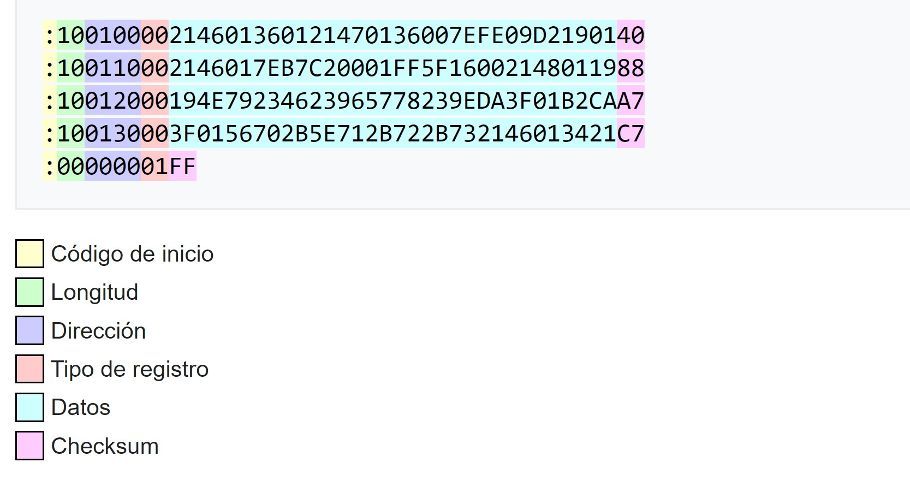
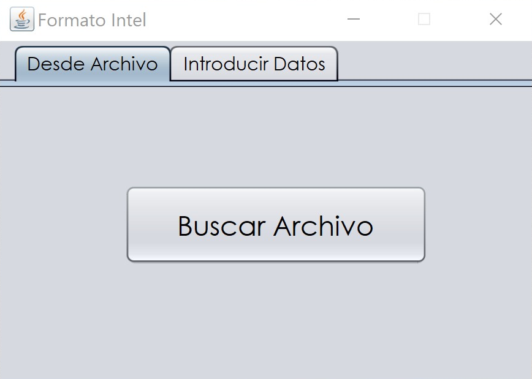

## Intel Format Conversor

This project converts a .txt file with a specified format into a .hex file with the intel format. 

For the purpose of this project the length always will be 16, if there are less data it will be padded.

The project was made in Netbeans, with the 12.0 JDK version, the full project (code) is in the 'Intel' directory, in the 'Release' directory you will find the jar program to test it. 

There are two ways in which the program can generate a .hex file, with a .txt file or using the input wiwndow in the program. 

#### Via text file:

A window will open in which a .txt file could be selected. The .txt file must have the initial direction (in decimal) in the first line, the rest of the document must contain the hexadecimal instructions.

#### Via input terminal:

Similar to the previous case, we must define an initial direction in decimal, then the name of the .hex output file and finally the set of instructions in the corresponding area. 

In both cases, the program will only recognize valid hexadecimal instructions, which must be from 0-F with a length of 2 characters.

There are a couple of examples in the release folder, so you can see the format of the input and output files.

By: *L. Enrique Vergara B.*